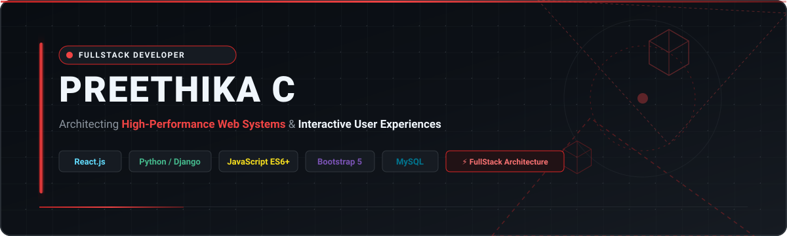
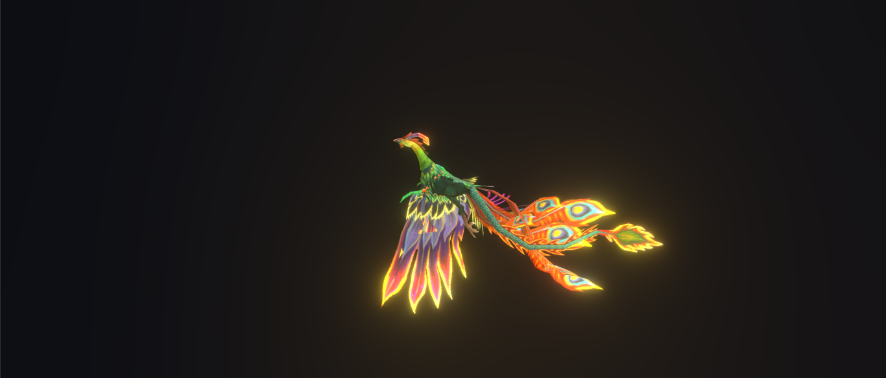
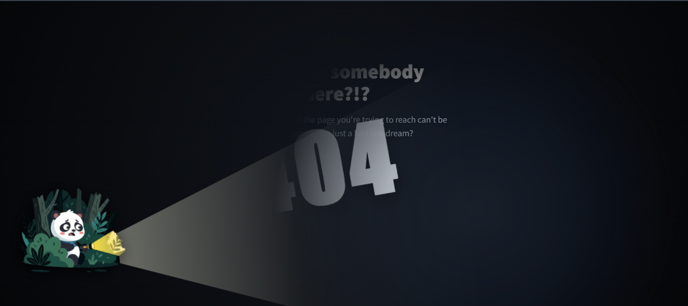
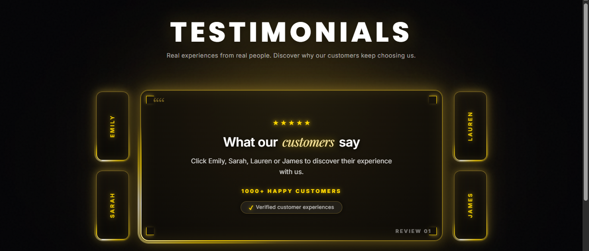

  

 

 

<!-- ABOUT ME CARD -->
<table width="100%" style="font-family: 'Segoe UI', 'Inter', system-ui, -apple-system, BlinkMacSystemFont, Roboto, sans-serif;">
  <tr>
    <td bgcolor="#0D1117" style="border: 2px solid #DC2626; border-radius: 12px; padding: 24px;">
      

        
      

       
      

        <h2 align="left" style="color: #F0F6FC; border-bottom: 2px solid #DC2626; padding-bottom: 8px; font-family: 'Segoe UI', 'Inter', sans-serif; font-weight: 700;">
          ⚡ FullStack Developer | Crafting Dynamic &amp; Scalable Web Applications
        </h2>
        

          Hello! I'm <b>Preethika C</b>, a passionate <b>FullStack Developer</b> focused on building high-performance frontend interfaces and robust backend architectures.
        

        

          🎯 <b>Core Focus:</b> Building responsive, modern web applications, implementing efficient data handling with Django &amp; MySQL, and engineering interactive UI experiences with React and JavaScript.
        

      

    </td>
  </tr>
</table>

 

<!-- TECH STACK MATRIX -->
<h2 align="left" style="color: #F0F6FC; font-family: 'Segoe UI', 'Inter', sans-serif; font-weight: 700;">🛠️ Technical Skills &amp; Stack</h2>

<table width="100%" style="font-family: 'Segoe UI', 'Inter', system-ui, -apple-system, BlinkMacSystemFont, Roboto, sans-serif;">
  <tr>
    <th width="30%" bgcolor="#161B22" style="color: #EF4444; border: 1px solid #30363D; padding: 10px; font-size: 16px; font-family: 'Segoe UI', 'Inter', sans-serif;">Category</th>
    <th width="70%" bgcolor="#161B22" style="color: #F0F6FC; border: 1px solid #30363D; padding: 10px; font-size: 16px; font-family: 'Segoe UI', 'Inter', sans-serif;">Technologies &amp; Tools</th>
  </tr>
  <tr>
    <td bgcolor="#0D1117" style="color: #F0F6FC; border: 1px solid #30363D; padding: 12px; font-weight: bold; font-family: 'Segoe UI', 'Inter', sans-serif;">
      🎨 Frontend 
    </td>
    <td bgcolor="#0D1117" style="border: 1px solid #30363D; padding: 12px;">
      
      
      
      
      
    </td>
  </tr>
  <tr>
    <td bgcolor="#0D1117" style="color: #F0F6FC; border: 1px solid #30363D; padding: 12px; font-weight: bold; font-family: 'Segoe UI', 'Inter', sans-serif;">
      ⚙️ Backend &amp; Database
    </td>
    <td bgcolor="#0D1117" style="border: 1px solid #30363D; padding: 12px;">
      
      
      
    </td>
  </tr>
  <tr>
    <td bgcolor="#0D1117" style="color: #F0F6FC; border: 1px solid #30363D; padding: 12px; font-weight: bold; font-family: 'Segoe UI', 'Inter', sans-serif;">
      🧰 Tools &amp; Workflow
    </td>
    <td bgcolor="#0D1117" style="border: 1px solid #30363D; padding: 12px;">
      
      
      
    </td>
  </tr>
</table>

 

<!-- FEATURED PROJECTS -->
<h2 align="left" style="color: #F0F6FC; font-family: 'Segoe UI', 'Inter', sans-serif; font-weight: 700;">🚀 Top Featured Projects</h2>

<!-- PROJECT 1 -->
<table width="100%" style="font-family: 'Segoe UI', 'Inter', system-ui, -apple-system, BlinkMacSystemFont, Roboto, sans-serif;">
  <tr>
    <td bgcolor="#0D1117" style="border: 2px solid #DC2626; border-radius: 12px; padding: 20px;">
      

        
      

       
      

        <h3 style="color: #EF4444; margin-top: 0; font-family: 'Segoe UI', 'Inter', sans-serif; font-weight: 700;">🦚 Royal Phoenix 3D Perspective Showcase</h3>
        

          An immersive web showcase utilizing advanced CSS3 perspective transformations, dynamic lighting, and JavaScript event handlers to project an interactive 3D Royal Phoenix presentation.
        

        

          <b>Key Features:</b> Hardware-accelerated CSS 3D matrix transforms, interactive visual perspective tracking, dynamic illumination effects, and smooth frame rates.
        

        

          
          
          
        

         
        
        &nbsp;
        
      

    </td>
  </tr>
</table>

 

<!-- PROJECT 2 -->
<table width="100%" style="font-family: 'Segoe UI', 'Inter', system-ui, -apple-system, BlinkMacSystemFont, Roboto, sans-serif;">
  <tr>
    <td bgcolor="#0D1117" style="border: 2px solid #DC2626; border-radius: 12px; padding: 20px;">
      

        
      

       
      

        <h3 style="color: #EF4444; margin-top: 0; font-family: 'Segoe UI', 'Inter', sans-serif; font-weight: 700;">🐼 Interactive Flashlight 404 Experience</h3>
        

          An engaging interactive 404 page engineered with real-time mouse spotlight tracking, vector graphics manipulation, and fluid DOM state changes.
        

        

          <b>Key Features:</b> Real-time cursor tracking flashlight beam, custom SVG shadow masking, responsive layout, and interactive fallback UX.
        

        

          
          
          
        

         
        
        &nbsp;
        
      

    </td>
  </tr>
</table>

 

<!-- PROJECT 3 -->
<table width="100%" style="font-family: 'Segoe UI', 'Inter', system-ui, -apple-system, BlinkMacSystemFont, Roboto, sans-serif;">
  <tr>
    <td bgcolor="#0D1117" style="border: 2px solid #DC2626; border-radius: 12px; padding: 20px;">
      

        
      

       
      

        <h3 style="color: #EF4444; margin-top: 0; font-family: 'Segoe UI', 'Inter', sans-serif; font-weight: 700;">✨ Interactive Glowing Testimonials Showcase</h3>
        

          A luxury dark-themed testimonial showcase featuring interactive client switching, glowing border effects, dynamic content renderers, and modern UI aesthetic.
        

        

          <b>Key Features:</b> Interactive tab switching, CSS box-shadow glowing effects, clean component architecture, and responsive UI grid layout.
        

        

          
          
          
        

         
        
        &nbsp;
        
      

    </td>
  </tr>
</table>

 

<!-- CONNECT & CONTACT FOOTER -->
<table width="100%" style="font-family: 'Segoe UI', 'Inter', system-ui, -apple-system, BlinkMacSystemFont, Roboto, sans-serif;">
  <tr>
    <td bgcolor="#0D1117" align="center" style="border: 1px solid #30363D; border-radius: 12px; padding: 20px;">
      <h3 style="color: #F0F6FC; margin-bottom: 10px; font-family: 'Segoe UI', 'Inter', sans-serif; font-weight: 700;">🤝 Let's Connect &amp; Build Together</h3>
      

        Open to fullstack web development roles, collaborative software projects, and technical discussions.
      

      
    </td>
  </tr>
</table>
